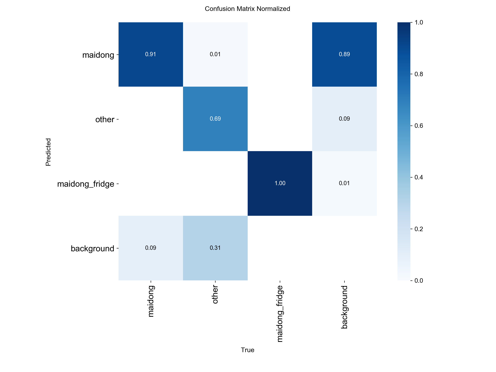
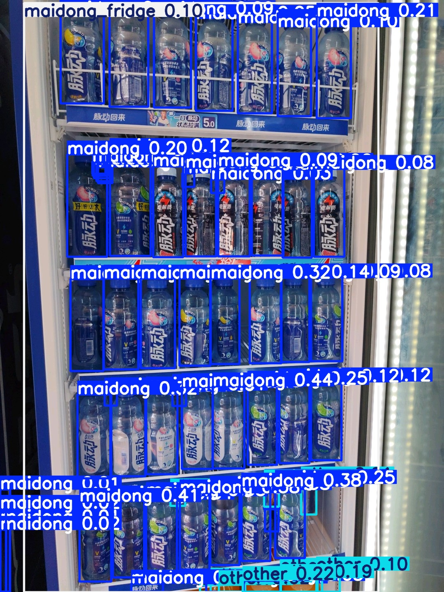
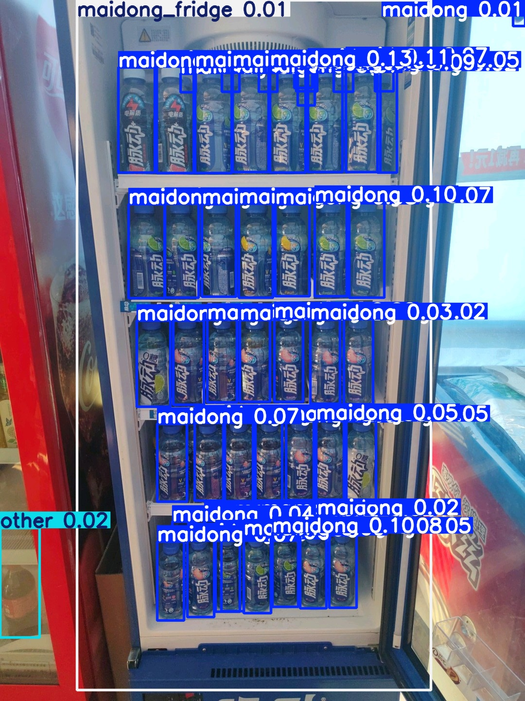
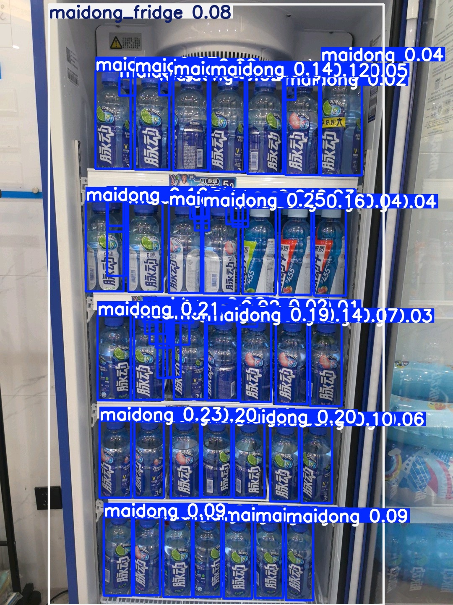
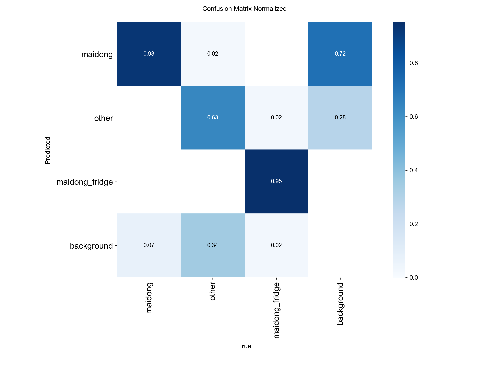
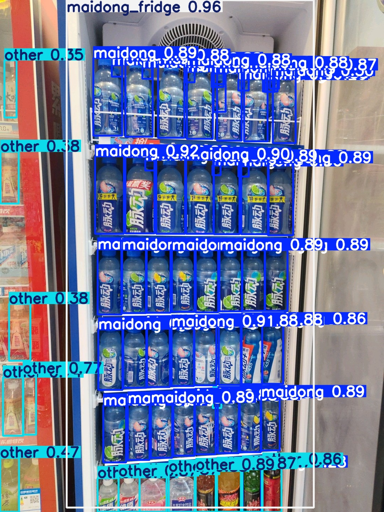
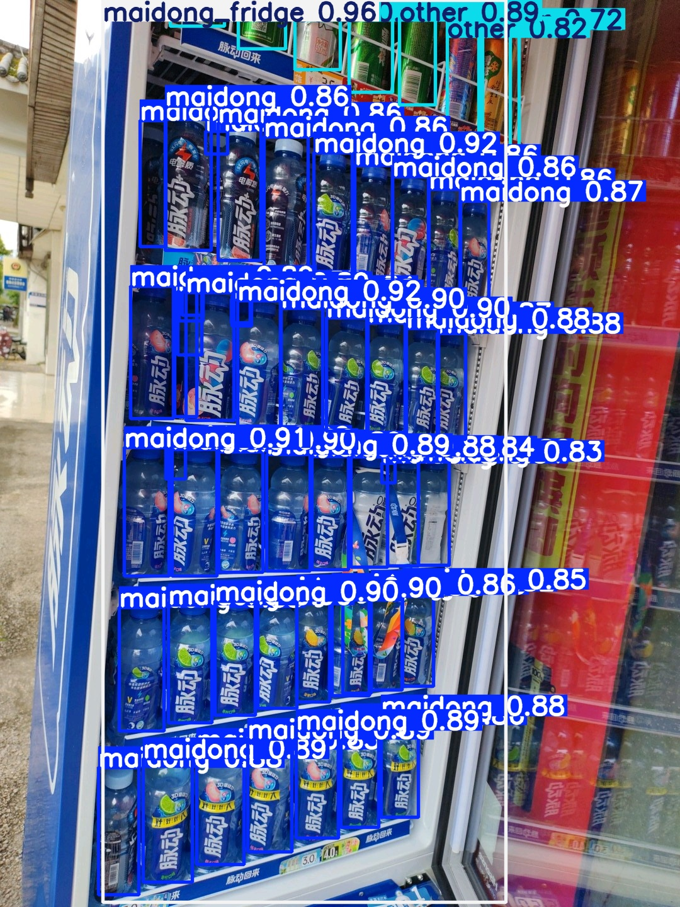
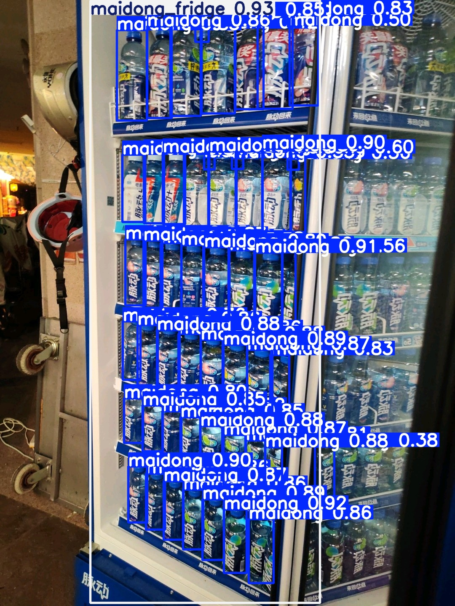

# Fridge Product Detection with YOLOv8, yolov10

This project focuses on detecting and classifying beverage products inside a fridge using YOLOv8, yolov10, with a primary goal of identifying **Maidong (脉动)** vs **other products**, and supporting downstream purity analysis.

## Project Goals

- Detect products inside fridge scenes
- Classify:
  -  Maidong (脉动)
  -  Other products
  -  Maidong fridge region
- Build a scalable annotation pipeline
- Reduce manual labeling effort using auto-labeling
- Enable iterative model improvement

 ---
##  Workflow

### 1️ Manual Annotation
- Annotate ~100 images using `labelImg`
- Labels stored in `data/labels`
labelImg clone from: https://github.com/tzutalin/labelImg.git

```bash
cd /Users/liangqiuying/Desktop/fridge_eval_project/labelImg
python3 labelImg.py ../data/images ../data/labels/classes.txt ../data/labels
```
---

### 2️ Create Train/Val Split

```bash
python split_dataset.py
```

### 3 Train initial Model for auto-labelling
```bash
yolo detect train data=dataset.yaml model=yolov8n.pt epochs=80 imgsz=768
```
- the initial model was trained using 100 manually labeled images and serves as a bootstrap model for auto-labeling the remaining dataset.
- Model: YOLOv8n
- Training epochs: ~80
- Input size:768
- Output checkpoint: runs/detect/train-6/weights/best.pt



### Observations:
- The initial model is able to distinguish general object regions
- classification between maidong and other is still imperfect
- misclassification are expected due to limited training data
- performance will improve after iterative retraining

### Performance:




### 4 Auto label remaining 400 images
```bash
yolo detect predict model=runs/detect/train6/weights/best.pt source=data/images conf=0.01 save_txt=True save=True
```

- Low conf ensures maximum box recall, with conf=0.01
- Accuracy is not critical at this stage

### 5 Manual correction
- correct the 100 auto-labelled images --> 200 correctly labelled images

### 6 fine-tuning with initial model
```bash
data=dataset_continue.yaml \
model=runs/detect/train-6/weights/best.pt \
epochs=100 \
imgsz=768 \
project=runs_continue
```
- the bootstrap model was fine-tuned using 200 refined samples (100 manually labeled + 100 auto-labeled with manual correction) to enhance detection accuracy for maidong bottles and fridge regions.
- Model: runs/detect/train-6/weights/best.pt (YOLOv8n architecture)
- Training epochs: 100
- Input size: 768
- Output checkpoint: runs_continue/yolo_continue/train/weights/best.pt



### Observations:
- The fine-tuned model demonstrates significant improvement in distinguishing maidong bottles from other objects, achieving 93% accuracy on the maidong class.
- Classification between maidong and other has been greatly enhanced compared to the initial bootstrap model, with misclassification rates substantially reduced.
- The "other" category remains the primary challenge (63% accuracy), which is expected given the limited and diverse samples of non-maidong brands in the training set.
- maidong_fridge detection achieved excellent performance (95% accuracy), indicating robust generalization for fridge region identification.
- Overall model performance (mAP@0.5: 0.853) 
- Future migration to YOLOv10 is expected to further improve performance, particularly for challenging categories like non-maidong brands.

### Performance:




### 7 retrain model with yolov10
